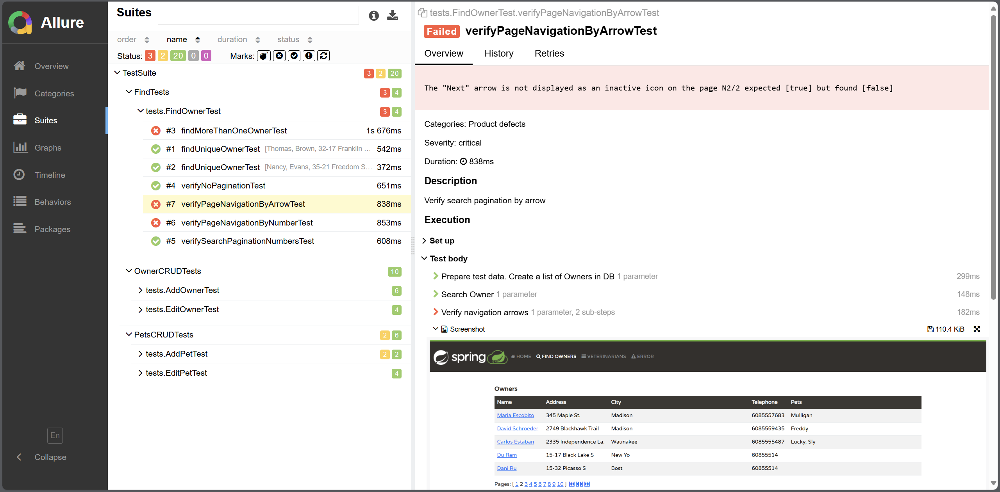
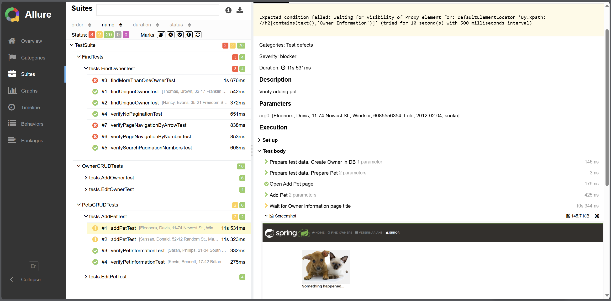

## Tests for Spring PetClinic Sample Application

### <a href="https://github.com/spring-projects/spring-petclinic">See the application project here</a>

### About application

The Petclinic application is a database of a veterinary clinic. It contains a search by clients, functionality for adding, editing, and viewing information about pets, their owners, and visits, and information about specialists.

Petclinic is a [Spring Boot](https://spring.io/guides/gs/spring-boot) application built using [Maven](https://spring.io/guides/gs/maven/) with MySQL database.

### About test project

The aim of the test project was to study the test's interaction with databases, using **JDBC template** and **Data-Driven** testing. There was no aim to covering the whole project with tests.
Over time, the project became a sandbox for refactoring, demonstrating the capabilities of test automation.

### Test project's stack:

* Selenium
* Java
* Maven
* TestNG
* MySQL / JDBC Template
* Allure Report

### Test project's design patterns:

* Page Objects
* Page Factory
* Steps/Chain of Invocations
* Value Object
* Builder

### Allure Report

To generate a useful report, the Steps and Listener are used. In case of any failure (assert fails or exception appears), the screenshot is taken and attached to the report.

At the time the test's creation, the application had the search pagination bug and add pet bug, so some tests fail as expected.

